<h1 align="center">Hi there 👋, I'm Massine</h1>

  🎓 Final-year MEng Student at <strong>CentraleSupélec</strong> — <strong> Mathematics and Data Science</strong> 
  📚 MVA (Mathematics, Vision & Learning) Master's at <strong>ENS Paris-Saclay</strong> 
  🌍 Research experience at <strong>UM6P</strong>, <strong>Stanford University</strong>, and <strong>New York University</strong>

  <picture>
    <source media="(prefers-color-scheme: dark)" srcset="./assets/banner-dark.svg">
    <source media="(prefers-color-scheme: light)" srcset="./assets/banner-light.svg">
    
  </picture>

---

### 📫 How to reach me

  
  
  

---

### 🧑‍💻 About Me
- **Stanford University** — AI for cancer genomics  
- **New York University** — Information Geometry & Generative Models  
- **UM6P / OCP Group** — Commodity pricing with stochastic & time-series models  
- Past collabs with **Thales**, **Air France** & **EDF**

---

### 🚀 Featured Projects
- **DiffGuard** — Fine-tuned LLMs for safe diffusion models *(Thales)*
- **Synthetic Lethal Mining** — Deep learning for drug discovery *(Stanford)*  
- **Fertilizer Pricing** — Extreme-value theory + SARIMAX *(UM6P/OCP)*

---

### 🔭 Currently Exploring
- RL for LLMs (PPO / TRPO / GRPO)  
- Optimal Transport & Information Geometry  

<!--
**MassineELKHADER/MassineElKhader** is a ✨ _special_ ✨ repository because its `README.md` (this file) appears on your GitHub profile.

Here are some ideas to get you started:

- 🔭 I’m currently working on ...
- 🌱 I’m currently learning ...
- 👯 I’m looking to collaborate on ...
- 🤔 I’m looking for help with ...
- 💬 Ask me about ...
- 📫 How to reach me: ...
- 😄 Pronouns: ...
- ⚡ Fun fact: ...
-->
